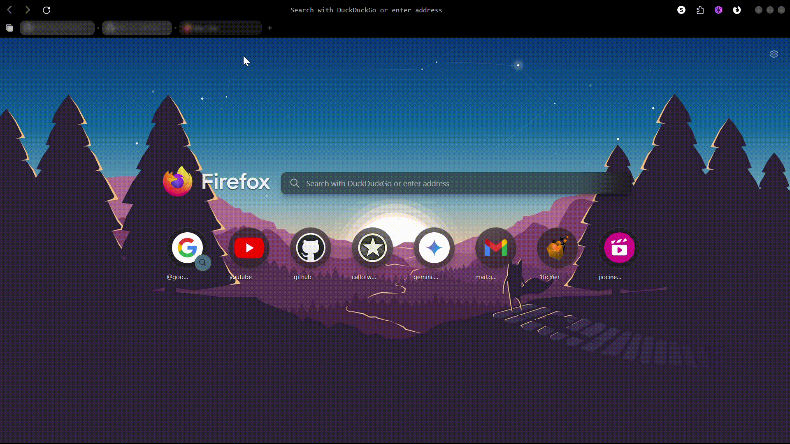

# Please read the codes in the User.js file properly before using. 
*********************************************************************

# How to use:

* download the 
* Open your firefox browser.
* In the url bar, type `about:support`
* Go to profile folder
* There click the `open folder` option. This will direct you to your file manager .
* Now search for `User.js` file
* Open the `User.js` file.
* Now copy and paste the `User.js` file. 
* Close the Firefox browser and reopen it. All the changes will be applied.

# preview:

# Made by using

1. 
2. 

